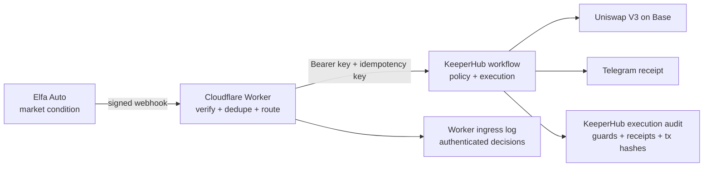

# Elfa → KeeperHub Bridge

## 3.83M requests in August. 4M+ voices monitored. 600K+ tokens and markets tracked.

Elfa reported [3.83 million total requests in August 2026](https://x.com/elfa_ai/status/2094726966264070642)
after [five consecutive record months](https://www.elfa.ai/blog/trade-removal-doubling-down-on-agent-intelligence).
It also reported [more than 1.8 million developer API calls that month](https://x.com/elfa_ai/status/2095503321855352866).
Elfa's website lists [4M+ voices and 600K+ tokens and markets](https://www.elfa.ai/). It says more
than 300 builder and product teams use the platform.

Elfa retired its Trade page to focus on real-time intelligence for exchanges, execution venues,
and financial agents. That leaves each integrator responsible for turning a high-volume stream of
market signals into safe execution. Before a trigger can move money, someone must authenticate it,
drop replays and duplicate deliveries, and prevent the incoming event from choosing the amount,
asset, chain, or recipient. This bridge gives Elfa triggers that execution boundary through
KeeperHub.

Elfa Auto can watch markets continuously and emit an event when a condition becomes true. The
work after that trigger belongs to the operator's runner: Elfa's own documentation assigns the
runner verification, deduplication, strategy continuation, audit logging, and retries. That is a
risky boundary for an on-chain workflow.

A retried webhook can execute twice. A forged request can execute once. A stale request can be
replayed later. If the amount, token, chain, or recipient comes from the event body, an upstream
change can alter what the wallet does.

There is also a practical connection problem. Elfa signs webhook deliveries with its own HMAC
headers. KeeperHub webhook triggers require an `Authorization: Bearer wfb_...` header. Elfa cannot
add that header, so the two services cannot connect directly.

Elfa's [Agent Runner guide](https://docs.elfa.ai/auto/agent-runner/) describes this division of
responsibility. Its [Notifications guide](https://docs.elfa.ai/auto/notifications.md) specifies
the signature, timestamp, raw-body, and event-id contract used here.

## What this is

This repository provides the narrow adapter between those systems.



The full visual walkthrough is in [`docs/architecture.html`](docs/architecture.html).

Elfa decides **when**. KeeperHub decides **how**. The bridge proves who sent the event, rejects
replays and duplicates, adds the authentication header KeeperHub needs, and records its decision.

The KeeperHub workflow then:

1. checks that the wallet holds at least `0.0025 ETH`;
2. quotes a fixed `0.002 ETH` WETH→USDC swap on Base through Uniswap V3;
3. refuses if the quote is below the fixed slippage floor;
4. swaps and sends the transaction hash to Telegram.

The event cannot choose the amount, asset, chain, recipient, protocol, or price floor. Those values
are fixed in the KeeperHub workflow and pinned by invariant tests.

## Two audit layers

The Worker and KeeperHub record different parts of one run:

- The Worker ingress log records authenticated events that it forwards or rejects, including
  stale, lifecycle, unrouted, duplicate, and kill-switch outcomes. It rejects missing or invalid
  HMAC signatures before writing to KV, so those requests leave no public audit row.
- KeeperHub's execution audit starts after the Worker forwards an accepted event. It records the
  trigger, balance and quote values, guard branches, swap result, transaction receipt, and Telegram
  result. KeeperHub cannot record a request that the Worker rejects because it never receives it.

BaseScan supplies independent confirmation for a transaction that KeeperHub executed. In the
demo, use the Worker log to prove ingress security and KeeperHub's audit to prove execution.

The bridge has no LLM in the execution path, does not trade on Hyperliquid, and is designed for one
operator. Hyperliquid supplies the short-lived price trigger used for filming; Base is where the
demonstrated transaction executes.

## Safety behavior

The Worker applies these gates in order:

| Input or state | Result |
| --- | --- |
| Missing or invalid HMAC | Reject before any KV write |
| Timestamp older than 30 seconds | Reject and audit |
| Kill switch disabled | Drop and audit |
| Signed lifecycle event such as `expired` or `run-failed` | Drop and audit; never execute |
| Query ID has no configured route | Drop and audit |
| Event ID already seen | Drop as duplicate |
| KeeperHub transient error | Acknowledge Elfa, then retry with the same idempotency key |
| Wallet or quote below its floor | KeeperHub stops before the swap and sends Telegram |

`GET /health` exposes configuration health and counters. `GET /audit` returns recent bridge
decisions as JSON; add `?format=html` for a human-readable table. Raw webhook bodies are never
shown on the public audit endpoint.

## Run it

Requirements: Node.js, an Elfa API key, a high-entropy Elfa webhook signing secret, a KeeperHub API
key and webhook key, a KeeperHub workflow ID, Cloudflare credentials, and a Telegram integration
attached to the workflow. Copy `.env.example` to `.env` and fill its values. Do not commit `.env`.

Install and verify:

```bash
npm install
npm test
npx wrangler login
```

Create a Cloudflare KV namespace once, then place its ID in `wrangler.toml`:

```bash
npx wrangler kv namespace create BRIDGE
```

Upload the two Worker secrets. Wrangler prompts for each value and does not write it to the repo:

```bash
npx wrangler secret put ELFA_SIGNING_SECRET
npx wrangler secret put KEEPERHUB_WEBHOOK_KEY
```

Deploy the Worker before creating an Elfa plan. Elfa resolves the webhook host during plan
creation and rejects a host that does not resolve.

```bash
npx wrangler deploy
```

Create the standing BTC funding plan, route it to the configured KeeperHub workflow, enable the
bridge, and redeploy the route configuration:

```bash
npm run bridge -- setup
npm run bridge -- status
```

For a short-lived demo, choose a BTC threshold just above spot so the condition crosses soon:

```bash
npm run bridge -- teardown
npm run bridge -- setup --film --threshold <BTC_PRICE>
npm run bridge -- status
```

The deterministic harness can exercise a valid delivery and the refusal paths without waiting for
the market:

```bash
npm run bridge -- fire --event-id demo-1
npm run bridge -- fire --event-id demo-1
npm run bridge -- fire --event-id demo-forged --bad-sig
npm run bridge -- fire --event-id demo-stale --stale
npm run bridge -- fire --event-id demo-unrouted --unrouted
```

`teardown` cancels only the active Elfa plan IDs listed in this repository's routes, clears those
routes, disables the bridge, and deploys the disabled configuration.

## Mainnet proof

KeeperHub workflow `9lwespmlwr5ti4xyx817j` executed a fixed `0.002 ETH` swap on Base mainnet:

- KeeperHub execution: `cgxl31n4l3sns4zy15pqc`
- Result: `4.922114 USDC`
- Base transaction:
  [`0x79ab…10cd`](https://basescan.org/tx/0x79ab494c3f0f65c63986c1410a503e0167c94f3175492e263b81035e8eac10cd)
- Receipt: success, verified by KeeperHub
- Gas: sponsored by KeeperHub
- Telegram: success message delivered

A second execution, `enykq0mq4ejhy1055wbm4`, reached the balance guard and stopped. It produced no
transaction and sent the skip notification. The complete evidence is in
[`docs/PROOF.md`](docs/PROOF.md).

## Known limits

- Cloudflare KV is eventually consistent, so its `seen:` record is a fast duplicate filter rather
  than the final guarantee. The bridge propagates the Elfa event ID as KeeperHub's idempotency key;
  that downstream key is what prevents two executions during a KV race.
- The price floor is deliberately fixed. A sharp ETH move can make a valid trigger refuse instead
  of trading. This is a safety outcome, not an attempt to chase the market.
- The live price-floor refusal is test-proven but not mainnet-proven. After the successful swap,
  the remaining wallet balance was below the earlier balance guard, so the later live refusal
  stopped before quoting.
- KeeperHub's simulator currently reports zero simulated nodes for the protocol-specific Uniswap
  action. The successful Base receipt is the execution proof for that node.
- Version 1.0.1 is deployed, enabled, and routed. Live harness events proved a successful forward
  plus duplicate, stale, forged, and unrouted handling. The Elfa film plan did not emit a market
  trigger, but it did emit a genuine signed expiry notification. That event led to lifecycle-event
  hardening, and a second live probe proved the deployed `dropped:lifecycle` gate.

## Submission context

Built for the [Elfa × KeeperHub Agent Economy Hackathon](https://dorahacks.io/hackathon/agent-economy/detail).
The repository contains the design, workflow definitions, tests, live evidence, CLI, and demo shot
list needed for a reproducible review.

Public source: https://github.com/damli40/elfa-keeperhub-bridge

For the shortest judge-facing explanation and recording order, use
[`docs/JUDGE-DEMO.md`](docs/JUDGE-DEMO.md).
