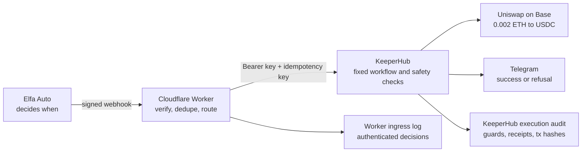

# Judge demo guide

## Opening hook

> 3.83 million total requests in August. More than 1.8 million developer API calls. More than four
> million voices monitored. More than 600,000 tokens and markets tracked.

Sources: [Elfa's August record](https://x.com/elfa_ai/status/2094726966264070642),
[developer API usage](https://x.com/elfa_ai/status/2095503321855352866), and
[current product metrics](https://www.elfa.ai/).

Elfa reached five consecutive record months, then retired its Trade page to focus on market
intelligence for agents and execution venues. Existing users still need to turn those triggers into
transactions. The bridge supplies the authentication, duplicate protection, fixed execution
policy, and audit trail needed before an automated signal can move money.

## One-sentence explanation

Elfa watches the market, the Worker verifies each trigger, and KeeperHub executes a fixed,
reviewed workflow that the incoming message cannot rewrite.

## Architecture



The two logs cover different boundaries. The Worker records whether an authenticated Elfa event
may reach KeeperHub. KeeperHub records what its workflow does after it accepts the trigger. It
cannot audit an event that the Worker rejects because that event never reaches KeeperHub.

## What the build does

Elfa Auto monitors a market condition and signs its webhook. The Cloudflare Worker checks the
signature against the exact request body, rejects stale events, blocks lifecycle notifications,
checks the query route, and drops duplicate event IDs. It then adds the KeeperHub webhook key and
forwards the same event ID as an idempotency key.

KeeperHub owns every money-moving choice. The workflow fixes the wallet, Base network, token
addresses, Uniswap fee tier, `0.002 ETH` amount, balance guard, quote floor, and recipient. The
Elfa payload cannot change any of them. KeeperHub either swaps and sends the transaction hash to
Telegram or stops at a guard and explains the refusal.

The live evidence covers three separate claims:

1. Elfa delivered a genuine signed expiry notification to the Worker.
2. Signed harness events proved the live Worker-to-KeeperHub path, duplicate handling, and refusal
   paths without spending more funds.
3. KeeperHub executed the existing `0.002 ETH` mainnet swap and produced a verified Base
   transaction.

## Prepare before recording

Open these pages in separate tabs:

- Source: https://github.com/damli40/elfa-keeperhub-bridge
- Worker audit: https://elfa-keeperhub-bridge.meanwhile-waittime.workers.dev/audit?format=html
- Worker health: https://elfa-keeperhub-bridge.meanwhile-waittime.workers.dev/health
- Base transaction:
  https://basescan.org/tx/0x79ab494c3f0f65c63986c1410a503e0167c94f3175492e263b81035e8eac10cd
- KeeperHub workflow `9lwespmlwr5ti4xyx817j`
- KeeperHub successful execution `cgxl31n4l3sns4zy15pqc`
- KeeperHub refusal execution `7c6xsp26ijw29w5laz3cq`
- Telegram conversation showing the success and skip messages

Prepare one terminal at the repository root. Increase the font size. Close `.env`, shell history,
Cloudflare settings, KeeperHub API settings, and Telegram BotFather.

## Two-and-a-half-minute demo

| Time | Show | Say | Criterion |
| --- | --- | --- | --- |
| 0:00–0:20 | Elfa usage figures, then the diagram | “Elfa handled 3.83 million requests in August after five record months. It retired trading to focus on intelligence. We built the safe execution path its triggers now need.” | Integration depth and usefulness |
| 0:20–0:40 | Elfa plan and Worker `/health` | “This is a live Elfa plan routed to a deployed Worker. Version 1.0.1 is enabled with one route.” | Real named integration |
| 0:40–1:10 | KeeperHub workflow canvas | “The webhook carries no amount, token, network, or recipient. KeeperHub fixes those values, checks the wallet balance, takes a Uniswap quote, checks the price floor, and either swaps or sends a refusal.” | Execution depth and safety |
| 1:10–1:35 | Worker ingress log | “The ingress log shows a valid event forwarded once, its repeat dropped, a stale event refused, an unknown route dropped, and a lifecycle event blocked. The forged request is absent because bad signatures cause no storage write.” | Reliability and observability |
| 1:35–2:00 | KeeperHub successful execution, then BaseScan | “KeeperHub checked the balance and quote, swapped 0.002 ETH into 4.922114 USDC on Base, sponsored the gas, and sent the transaction hash to Telegram.” | Value moved through KeeperHub |
| 2:00–2:15 | KeeperHub refusal execution and Telegram | “The current wallet sits below the 0.0025 ETH guard. This later run stopped before the quote and swap, created no transaction, and sent the reason to Telegram.” | Failure handling |
| 2:15–2:30 | Terminal test result and GitHub repository | “The repository has 166 tests, a clean TypeScript check, workflow value invariants, setup and teardown commands, and a public proof record.” | Developer experience and code quality |

## Terminal commands for the recording

Show status first:

```bash
npm run bridge -- status
```

Show the quality gates:

```bash
npx tsc --noEmit
npm test
```

You do not need another live transaction. The existing BaseScan receipt proves value movement.
If you want one fresh no-spend event for the recording, use a new event ID and repeat it once:

```bash
npm run bridge -- fire --event-id demo-recording-1
npm run bridge -- fire --event-id demo-recording-1
```

The first request should reach KeeperHub's balance refusal. The second should return
`dropped:duplicate`. Confirm the first execution has no transaction hash before continuing.

## How each judging criterion gets answered

| Judge question | Evidence to show |
| --- | --- |
| Is this a deep integration with a live project? | The active Elfa plan, Elfa's real HMAC contract, the route to a named KeeperHub workflow, and the genuine signed Elfa expiry delivery |
| Did KeeperHub move value? | KeeperHub execution `cgxl31n4l3sns4zy15pqc` and the successful BaseScan transaction |
| Does it survive bad conditions? | Duplicate, forged, stale, unrouted, lifecycle, balance, quote, retry, and kill-switch behavior; show the public audit and refusal execution |
| Does it solve a useful problem? | Elfa cannot attach KeeperHub's bearer key. The bridge adds that missing authentication while keeping all money values outside the event payload |
| Could another developer use it? | Public source, README, workflow JSON, CLI commands, 166 tests, TypeScript check, proof record, and scoped teardown |

## Accuracy rules

- Call the Base swap a direct KeeperHub workflow proof run.
- Call the successful Worker execution a signed harness event.
- Call the Elfa expiry event genuine Elfa delivery, not a market trigger.
- Do not say the price-floor refusal ran on mainnet. Tests prove that branch; the live refusal used
  the balance guard.
- Do not expose credentials or run another funded swap during the recording.
